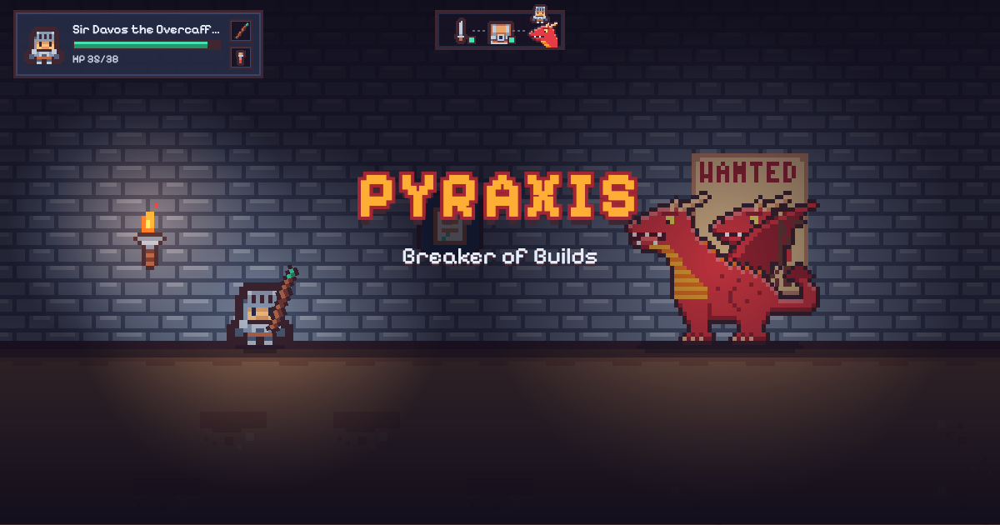
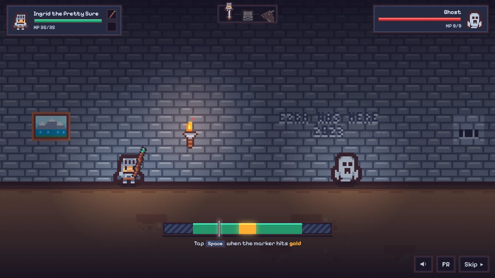
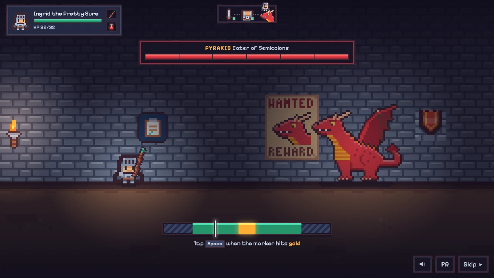
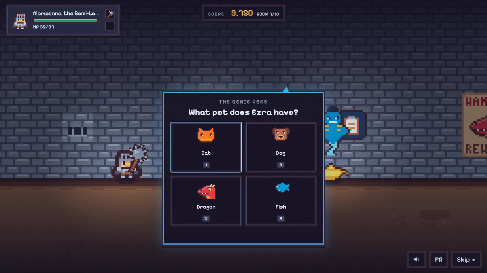
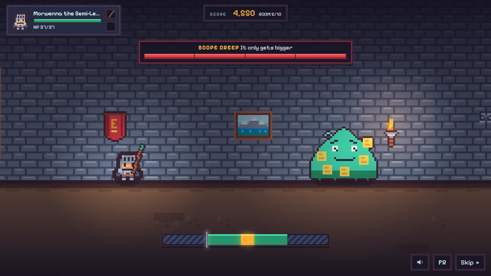
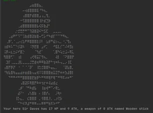

<div align="center">



# ⚔️ Pixel Dungeon

**A 25-second one-button dungeon that doubles as my portfolio,<br>a 2-minute hard mode with a leaderboard you can't fake,<br>and a secret roguelike for the ones who listen to the fairy.**

### [▶ Play it on strikwerda.fr](https://strikwerda.fr)

Vanilla JS · Canvas 2D · WebAudio · Node 24 · zero dependencies · EN / FR

</div>

---

## Three dungeons

|  | 🗡️ The easy run | 💀 The Real Dungeon | 🧚 The Deep Dungeon |
|---|---|---|---|
| **Length** | ~25 s | ~2 min | 4–7 min |
| **Rooms** | 1 fight, 1 chest, 1 dragon | 11 rooms: fights, a genie, a trap, a mid-boss, a final boss | A map of 13 locations you explore in the order you choose |
| **Goal** | Beat the dragon, get a rank (C → S) | Arcade score, top 5 on the wall of fame | Survive, top 10 on the wall of legends (ask the fairy) |
| **Controls** | One button: tap, click, Space or Enter | Same, plus 1–4 for answers | Same, plus number keys for menus |
| **Needs a server?** | No | Yes, every score is replayed server-side | To save a score, yes (replayed server-side) |

<table>
<tr>
<td></td>
<td></td>
</tr>
<tr>
<td></td>
<td></td>
</tr>
</table>

## 🗡️ The easy run

- **A random hero** each time: a warrior or a wizard, a silly epithet, rolled HP and ATK. 1 in 20 is legendary (gold, +2 ATK, +4 HP).
- **One button.** A marker sweeps a meter: gold is a PERFECT hit (×3), green is a HIT (×1), grey is WEAK (×0.25).
- **One monster**, then **a chest**: a d6 roll decides the loot, from nothing (1–2) to a legendary weapon and a large potion (6). Sometimes the chest is a mimic.
- **A dragon** with a segmented health bar that enrages at half HP: it hits harder and the meter speeds up.
- **A rank** from your share of PERFECT hits: C, B, A or S. Your best run is remembered in the browser.
- Then the **treasure**: my projects, GitHub and LinkedIn.

## 💀 The Real Dungeon

Reached from the treasure page. Keep the hero from your easy run (weapon and potion, HP refilled) or roll a new one.

| # | Room |
|---|---|
| 1–2 | Two monsters from a harder pool |
| 3 | 🧞 **The genie** asks a question about me. Right answer: points and a reward. Wrong: he laughs, you lose HP |
| 4 | 🏹 **Trap room.** Three arrows fly out of the wall; tap when the red **!** flashes to jump over them |
| 5 | 🟩 **SCOPE CREEP**, "It only gets bigger": a slime covered in sticky notes that grows and hits harder every second turn |
| 6 | 🎲 A chest, easy-mode rules |
| 7 | Another monster |
| 8 | 🧞 The genie again |
| 9 | One or two monsters |
| 10 | 🧞 The genie, always the same question: *Would you hire Ezra?* (Answering no has consequences) |
| 11 | ❓ **The final boss.** No spoilers. Go and meet it |

**Potions.** You carry up to two. When your HP drops low the game asks: drink, save it, or — with two — **DOUBLE SHOT**: both at once and double damage on the next hit.

**Meter.** Tighter than in the easy run, and every strike changes its speed and where the gold zone sits.

### Scoring

| Action | Points |
|---|---|
| PERFECT / HIT / WEAK | 600 / 100 / 10 |
| PERFECT streak | ×2, ×3, ×4, then ×5 |
| Dodged arrow | 200 |
| Right genie answer | 500, +250 under 5 s |
| Kill: monster / mid-boss / final boss | 250 / 1000 / 3000 |
| Room without taking damage | 300 |
| On victory: HP left / time bonus | 20 per HP / 20 per second under 150 s |

Dying keeps your points but loses both victory bonuses. The top 5 go on **the wall of fame** with three letters and a class icon ([live at strikwerda.fr/#wall](https://strikwerda.fr/#wall)), and every finished run gets a share link.

## 🧚 The Deep Dungeon

A fairy hangs around the treasure page. Click her if you dare.

- **Pick your challenge:** Normal, Difficult or Try Hard. Difficult and Try Hard make every room deeper down meaner than the last, bosses hit much harder and even PERFECT hits wear your gear (it will break, plan a way back); Try Hard also lets you carry only two potions and keeps the fairy mostly quiet. Higher levels multiply the score and get a badge on the wall.
- **Build your hero:** four classes (Knight, Rogue, Wizard, Barbarian) with their own perks, a starting weapon, a shield (wizards get magic wards) and a random name you can re-roll.
- **Explore:** a street of four doors. Rooms stay cleared, so walking back is safe but costs time. One door is locked, one path is a dead end, one leads down to the end.
- **Everything wears out** except your Wooden Stick and your Pot Lid (or Pointy Hat). PERFECT hits don't wear your weapon, weak hits wear it twice as fast. Loot is yours to take or to leave on the floor and come back for later.
- **Defend with timing:** a ring closes on you for every incoming hit. Tap as it touches you to PARRY (no damage, next strike ×1.5), a little off to BLOCK. Mashing does not work.
- **The gold zone is smaller** than in the other modes, wall arrows are back, one room holds fifteen monsters, and there is a mid-boss and a final boss I won't spoil.
- **Secrets:** be nice to the fairy and she whispers tips. There is more than one easter egg, and not every room is on the map.
- **Skill over luck:** the map and the loot are the same every run; only the meter, the attack rhythms and the monsters' move picks come from the seed. A balance simulation keeps skilled players alive and random tapping dead.

## 🛡️ Why the leaderboard is hard to fake

- The **server picks the seed**. Everything random (monsters, meter speed, genie rewards, arrow timing and more) comes from it.
- The browser sends **only its inputs**: tap times in milliseconds and choices. The server **replays the run** with the same engine code and computes the score itself. A score sent by hand is simply ignored.
- Runs must take at least **90 % of the replayed game time** in real time, tokens are **HMAC-signed and single use**, and starts and finishes are **rate-limited**.
- A **bot check** flags only near-perfect, zero-variance timing: human hands wobble, a script doesn't. Fast humans are never flagged on speed alone.
- The wall of fame shows the top 5 with three letters each. Everyone else only learns their own rank: no other names, no dates.

## 🧰 How it's built

```
src/
  easy/engine.js    easy run: seeded, logs every strike, replayable
  real/engine.js    hard mode as a pure state machine: expected(state) → apply(state, input) → events
  real/flow.js      browser side: prompts what the engine expects, animates the events
  deep/             the Deep Dungeon: engine, rhythm judge, rooms, scenes
  engine/           scheduler, integer-scale view, input, WebAudio sound effects, camera
  stage/ scenes/    canvas world and the animated scenes
  ui/               HTML/CSS HUD over the canvas
api/                zero-dependency Node 24 API: node:http, node:crypto, node:sqlite
scripts/art/        Python + Pillow script that draws the custom sprites
tests/              node:test suites, including balance simulations of thousands of runs
```

- **No build step, no dependencies.** Plain ES modules served as-is; the deploy script copies them into a content-hashed folder so browsers never mix versions.
- **CI/CD with GitHub Actions.** Every push runs the tests; a push to `main` deploys the API and the site once approved, through an unprivileged deploy user that can only restart the API container. Rollbacks are one manual run away.
- **Deterministic engines.** The same seed and inputs always give the same run, in the browser and on the server. The easy engine is replayed too, so a hero carried into the Real Dungeon is verified.
- **Pixel-perfect rendering.** The canvas runs at a small logical resolution scaled by an integer factor, so pixels stay square on every screen.
- **Sound without files.** Every effect is synthesized with the WebAudio API.
- **Balance by simulation.** Skilled, decent and random-tapping profiles play thousands of runs in the tests: random tapping dies almost every time, a decent player finishes in about two minutes.
- **Two languages.** English and French, picked from the browser and switchable in game.

## 🚀 Run it locally

Requires **Node 24** (for `node:sqlite`).

```bash
nvm use                 # reads .nvmrc
npm test                # all suites, no install needed
node scripts/dev.mjs    # site + API on http://localhost:8765 (in-memory database)
```

`?seed=42` fixes the easy-run seed, `?debug` exposes the game object in the console, `?deep&deepseed=7` jumps straight into an offline Deep Dungeon, `API_DOWN=1 node scripts/dev.mjs` shows how the site behaves when the API is unreachable.

## 🕹️ Where it comes from



This started as my 2023 school project: [**Dungeons & Dragons**](https://github.com/Adrew-Kirts/Dungeons_and_Dragons), a Java console game with a text menu, ASCII art, d6 rolls, chests and a dragon.

The remaster keeps the idea (random hero, dice, loot, dragon) and turns it into a one-button pixel game that fits between two coffee sips.

<br clear="right">

## Credits and license

- Code: [MIT](LICENSE).
- Sprites: Tiny Dungeon by [Kenney](https://www.kenney.nl) (CC0), plus custom sprites drawn in the same style by `scripts/art`.
- Fonts: [Pixelify Sans](https://github.com/eifetx/Pixelify-Sans), plus [Tiny5](https://github.com/Gissio/font_tiny5) for digits (both SIL Open Font License 1.1).
- Details in [CREDITS.md](CREDITS.md).
